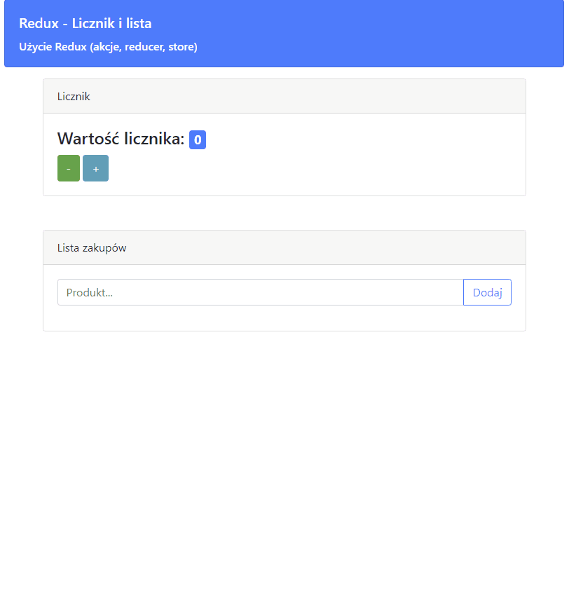

# Redux - przykład zastosowania biblioteki

Aplikacja jest czysto java scriptowa z zastowowaniem bibioteki Redux. Nie zawiera komponentów React. Pokazuje przykładowe użycie akcji, reducerów i store.  
Kliknij link, aby włączyć aplikację: [Live demo](https://www.adameczek.pl/redux-list.html)

## Licznik

Licznik składa się z dwóch kawiszy, którymi można zmieniać jego wartość. Domyślny krok to 1. Można ustawić inny zmieniając zdefiniowaną stałą i rekompilacjąc aplikację.

## Lista produktów

Tekst wpisany w oknie zostaje dodany do listy po naciśnięciu klawisza *ENTER* albo przycisku na ekranie. Każdy element listy ma klawisze *góra* i *dół*, którymi można zmieniać pozycję wpisu. 

    <a href="https://www.adameczek.pl/redux-list.html" target="_blank">
        
        <alt="Previev">
    </a>

## Użyte języki

- JavaScript
- HTML

## Frameworki i biblioteki

- Redux
- Bootstrap

---
Jeśli chcesz o coś spytać, tu jest moja [wizytówka](https://www.adameczek.pl "My Homepage") z danymi kontaktowymi.
